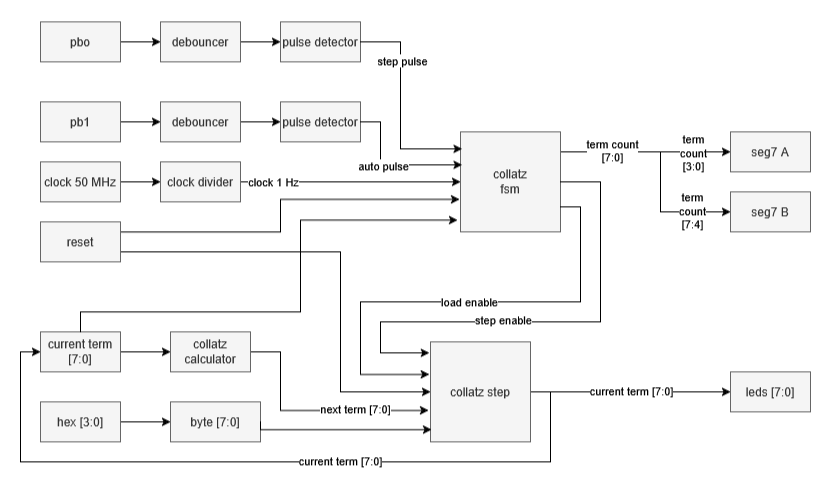

# FPGA Collatz Conjecture

A hardware implementation of the Collatz conjecture for 8-bit numbers (supporting sequence values from 0 to 255).

## Toolchain

* Target Chip: Altera MAX 10 (10M08SAE144C8G)
* Target Board: University of Waterloo LogicalStep Board
* Development Software: Intel Quartus Prime (Lite Edition)

## Architecture



### Core Modules

* debouncer.v: Filters mechanical contact bounce from the tactile push buttons to ensure a stable signal
* pulse_detector.v: Detects the rising edge of a button press by comparing the current and registered previous signal state
* clock_divider.v: Divides the onboard 50 MHz clock down to a 1 Hz clock to drive the automated sequence mode
* collatz_fsm.v: Finite state machine managing system states based on user inputs and the current sequence value
* collatz_calculator.v: Combinational logic block that computes $3n + 1$ (using an adder and a bit-shift) or $n/2$ (using a right bit-shift)
* collatz_step.v: Multiplexer that updates the current term with either the initial user input or the calculated next term

### Finite State Machine States

* IDLE: Reset state; system waits for an initial 8-bit term to be loaded
* HOLD: Initial term is selected; system is paused awaiting a mode selection
* STEP: Manual mode; advances the sequence by exactly one term per push of pb0
* AUTO: Automated mode; continuously advances the sequence at a rate of 1 Hz using the divided clock source
* DONE: Terminal state; reached automatically when the sequence stabilizes at 1

## Setup & Usage

#### 1. Clone the Repository

```bash
git clone https://github.com/walina-luwawu/collatz-conjecture.git
cd collatz-conjecture
```

#### 2. Open the Project
* Open Intel Quartus Prime
* Go to `File` > `Open Project` and select `LogicalStep_Lab2.qpf`

#### 3. Run Pin Assignments
* Run the TCL script via `Tools` > `Run TCL Scripts`
* Select `LogicalStep_Lab2.tcl` and click Run

#### 4. Compile Design

* Click Start Compilation (or press Ctrl + L) to synthesize, place, and route the design

#### 5. Program the Board

* Connect the LogicalStep board to your PC via a USB-Blaster cable
* Open the Programmer tool within Quartus
* Select the generated .sof file and click Start to program the Altera MAX 10
